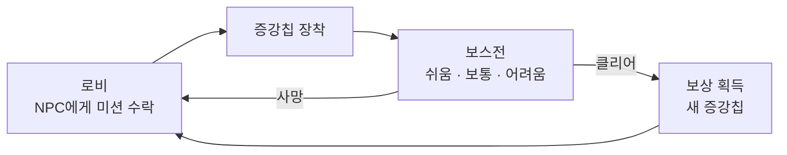
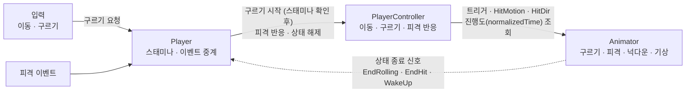
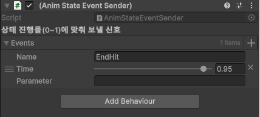
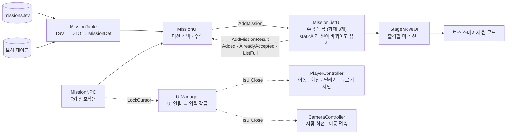
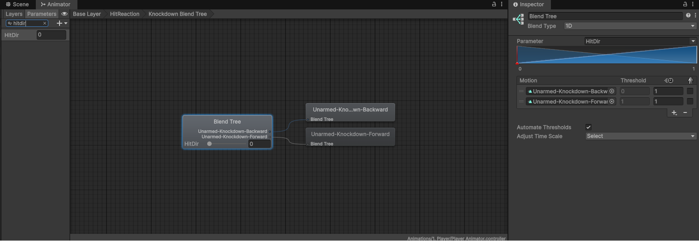

# ODDITY 프로젝트 문서

> **염동력과 증강칩 스킬로 보스를 상대하는 3D 3인칭 보스 레이드**


| 항목 | 내용 |
|---|---|
| 장르 | 3D 3인칭 보스 레이드 (보스 러시 + 소울라이크) |
| 기간 · 인원 | 2026.10.15 – 11.04 (약 3주) · 4인 팀 (학원 팀 프로젝트) |
| 엔진 · 도구 | Unity 6, C#, Git · Fork |
| 내 담당 | 플레이어 이동·구르기·피격 반응, 플레이어 애니메이터, 3인칭 카메라(기본 구조·상황별 전환), 미션 시스템, UI 입력 잠금, BGM·사운드, 에디터 툴 |
| AI 활용 | 카메라 첫 버전 초안, 미션 UI 조립 · 로비 자동 배치 에디터 툴에 Claude Code 사용 |
| 링크 | [시연 영상](https://youtu.be/aRoWtwR9jDg) · [쇼츠](https://youtu.be/MO5_aznJ0VY) · [GitHub](https://github.com/tmdrn17/ODDITY-Code) |

---

## 1. 개요

<a id="section-1-1"></a>
### 1.1 구르기 회피의 쾌감과 보스 러시를 잇는 미션

<iframe src="https://www.youtube.com/embed/aRoWtwR9jDg" title="시연 영상" allow="accelerometer; clipboard-write; encrypted-media; gyroscope; picture-in-picture" allowfullscreen style="display:block;width:55%;aspect-ratio:16/9;height:auto;border:0"></iframe>

3D 보스 레이드 팀 프로젝트에서 **플레이어 이동 · 구르기 · 피격**, **애니메이터**, **미션 시스템**을 담당했습니다.

<a id="section-1-2"></a>
### 1.2 목표한 경험과 기능마다의 의도

**팀이 목표한 경험** — 염동력을 기반으로 여러 스킬을 활용해 보스를 상대하며, 보스 러시 장르 특유의 고난도 컨트롤을 경험하게 하고 싶었습니다.

- **구르기** — 구르기 전후에 캐릭터가 미끄러지면 '피했다'는 느낌이 흐려지기 때문에, 애니메이션과 어긋나지 않고 입력한 만큼 정확히 굴러가는 조작을 목표로 했습니다.
- **피격 · 넉다운 반응** — 쓰러진 채 무력하게 기다리는 시간을 줄여 플레이어가 빨리 다시 조작하도록 조기 기상을 넣고, 계속 쓰면 넉다운이 의미 없어지지 않도록 쿨타임을 두었습니다.
- **3인칭 카메라** — 달릴 때는 카메라가 뒤로 물러나 속도감을, 물체를 잡을 때는 다른 피벗 · 거리로 조준감을 주고 싶었습니다.
- **미션 시스템** — 보스 러시 구조를 스킬인 증강칩 획득과 연결하기 위해 팀원들과 기획을 논의하며 만들었습니다.
- **UI 입력 잠금 · 에디터 툴** — UI를 조작하는 중에 캐릭터가 움직이지 않도록 입력 잠금을 한 곳에 모았고, 미션 UI 조립 · 로비 배치 같은 반복 작업은 에디터 툴로 줄였습니다.

<a id="section-1-3"></a>
### 1.3 게임 루프


```mermaid
flowchart LR
  A["로비<br/>NPC에게 미션 수락"] --> B["증강칩 장착"]
  B --> C["보스전<br/>쉬움 · 보통 · 어려움"]
  C -->|클리어| D["보상 획득<br/>새 증강칩"]
  D --> A
  C -->|사망| A
```

---

## 2. 시스템 구조

입력과 애니메이터를 잇는 플레이어 구조, 데이터로 흐르는 미션

<a id="section-2-1"></a>
### 2.1 플레이어


```mermaid
flowchart LR
  IN["입력<br/>이동 · 구르기"] -->|구르기 요청| P["Player<br/>스태미나 · 이벤트 중계"]
  HIT["피격 이벤트"] --> P
  P -->|"구르기 시작 (스태미나 확인 후)<br/>피격 반응 · 상태 해제"| PC["PlayerController<br/>이동 · 구르기 · 피격 반응"]
  PC -->|"트리거 · HitMotion · HitDir<br/>진행도(normalizedTime) 조회"| AN["Animator<br/>구르기 · 피격 · 넉다운 · 기상"]
  AN -.->|"상태 종료 신호<br/>EndRolling · EndHit · WakeUp"| P
```

Player는 바깥과 만나는 창구로서 스태미나 판단과 신호 중계를, PlayerController는 이동 · 구르기 · 피격 모션 같은 실제 처리를 맡도록 나눴습니다. 예를 들어 구르기 입력이 들어오면 요청만 Player로 올라가고, Player가 스태미나를 확인한 뒤 PlayerController에 구르기를 시킵니다. 애니메이션이 끝났다는 신호(EndRolling · EndHit · WakeUp)도 Player가 받아 PlayerController에 전달합니다. 덕분에 보스 · 스킬 · 증강칩처럼 플레이어의 체력과 스태미나를 다루는 팀원 기능은 Player 쪽에 붙일 수 있었습니다. 다만 실행 쪽인 PlayerController에도 기능이 계속 붙어 1,500줄까지 커졌습니다([5.3](#section-5-3)). UI가 열렸을 때 입력을 막는 방법은 [2.2.1](#section-2-2-1)에서 다룹니다.



<a id="section-2-2"></a>
### 2.2 미션


```mermaid
flowchart LR
  TSV[("missions.tsv")] --> T["MissionTable<br/>TSV → DTO → MissionDef"]
  RW[("보상 테이블")] --> T
  NPC["MissionNPC<br/>F키 상호작용"] --> UI["MissionUI<br/>미션 선택 · 수락"]
  T --> UI
  UI -->|AddMission| L["MissionListUI<br/>수락 목록 (최대 3개)<br/>static이라 씬이 바뀌어도 유지"]
  L -->|"AddMissionResult<br/>Added · AlreadyAccepted · ListFull"| UI
  L --> S["StageMoveUI<br/>출격할 미션 선택"]
  S --> SC["보스 스테이지 씬 로드"]
  NPC -.->|LockCursor| UM["UIManager<br/>UI 열림 → 입력 잠금"]
  UM -.->|IsUIClose| PC["PlayerController<br/>이동 · 회전 · 달리기 · 구르기 차단"]
  UM -.->|IsUIClose| CC["CameraController<br/>시점 회전 · 이동 멈춤"]
```

실선은 미션 데이터가 TSV에서 수락 목록을 거쳐 출격까지 가는 흐름이고, 수락 결과는 enum으로 UI에 돌아옵니다. 점선은 NPC 창이 열린 동안 입력을 막는 흐름입니다([2.2.1](#section-2-2-1)).

<a id="section-2-2-1"></a>
#### 2.2.1 UI가 열렸을 때 플레이어를 어떻게 멈출 것인가

| | 컴포넌트를 통째로 끄기 (처음 방식) | ✔ 선택: 잠금 값 하나를 두고 확인하기 |
|---|---|---|
| 방식 | 커서를 풀 때마다 PlayerController · CameraController를 `enabled = false`로 끔 | 컴포넌트는 켜 둔 채 UIManager의 잠금 값(isUIClose)을 두고, 이동 · 회전 · 달리기 · 구르기 · 카메라가 각각 이 값을 확인 |
| 장점 | 한 줄로 모든 조작이 멈춤 | 애니메이터 갱신 · 피격 처리 같은 나머지 동작은 그대로 돌아감 |
| 단점 | 스크립트 전체가 멈춰 애니메이터 값이 마지막 상태로 남음 · 커서는 UI뿐 아니라 Esc · 사망 · 보상창에서도 풀려 그때마다 꺼짐 | 확인하는 곳이 여러 군데로 흩어져, 한 곳을 빠뜨리면 막히지 않음(구르기 확인을 처음에 빠뜨렸다가 같은 날 추가) |

**선택한 이유** — 처음에는 다른 팀원이 다른 부분에서 쓰던 컴포넌트 끄기 방식을 따라 썼습니다. 그런데 걷거나 달리다가 Esc를 누르거나 UI를 열면, 조종 스크립트가 멈추면서 애니메이터의 걷기 값이 그대로 남아 캐릭터가 제자리에서 계속 걷는 모션을 보였습니다. 그래서 컴포넌트는 켜 두고 잠금 값으로 필요한 조작만 막는 방식으로 바꿨고, 확인하는 곳이 흩어지는 단점은 받아들였습니다. 이후 팀원이 염동력 · 스킬 · 일시 정지 메뉴의 입력 제한도 같은 잠금 값(IsUIClose)으로 통일해, 이 값이 팀의 UI 입력 제한 기준이 됐습니다.

```csharp
// UIManager.cs — 커서를 잠그거나 풀 때 잠금 값 하나만 바꿈 (컴포넌트는 끄지 않음)
public bool IsUIClose => isUIClose;

public void LockCursor(bool locked, bool isManuallyLock = false)
{
    Cursor.lockState = locked ? CursorLockMode.Locked : CursorLockMode.None;
    Cursor.visible = locked == false;
    isManuallyLocked = isManuallyLock;
    isUIClose = locked;
}

// PlayerController.cs — 이동 · 회전 · 달리기 · 구르기가 각자 이 값을 확인
private bool isUIClose => UIManager.Instance.IsUIClose;

IsSprinting = inputRaw != Vector2.zero && Mathf.Approximately(speed, runSpeed) && isUIClose;
if (isUIClose) controller.Move(totalMove * PlayerDeltaTime);
if (rotateTowardMove && moveVector.sqrMagnitude > 0.0001f && isUIClose) { /* 회전 */ }
if (isUIClose == false || IsActionLocked || IsHit || SimpleInput.GetKeyDown(Key.Space) == false) return;   // 구르기
```

[원본 코드: PlayerController.cs](#source-playercontroller)

---

## 3. 핵심 기능

<a id="section-3-1"></a>
### 3.1 애니메이션 진행도를 따라 움직이는 커브 기반 구르기


```csharp
public float GetSpeedAt(float normalizedTime)
{
    // ① 이동 구간(moveEndTime) 밖이면 멈춤
    if (normalizedTime < 0f || normalizedTime >= moveEndTime) return 0f;

    float moveSeconds = RollStateLength * moveEndTime;
    if (moveSeconds <= 0f) return 0f;
    // ② 커브 값은 기준 속도(rollDistance / 이동 시간)의 배율
    return rollDistance * Mathf.Max(0f,
        speedCurve.Evaluate(normalizedTime / moveEndTime)) / moveSeconds;
}

private float ReadRollNormalizedTime(out bool found)
{
    AnimatorStateInfo current = animator.GetCurrentAnimatorStateInfo(0);
    if (current.shortNameHash == rollStateHash)
        return current.normalizedTime;
    // ③ 전이 중이면 넘어가는 대상(Roll)의 진행도를 사용
    if (animator.IsInTransition(0)) { ... next.normalizedTime ... }
    ...
}
```

<a id="source-playercontroller"></a>
<details>
<summary>원본 코드 전체 보기 — PlayerController.cs</summary>

```csharp
// 발췌 — 원본 Assets/Scripts/1. Player/PlayerController.cs (1233줄 중 내가 쓴 줄 295줄, 커밋 411b6115)
// 내가 작성한 메서드만 옮겼습니다. 팀원이 작성한 부분은 "… 팀원 작성 부분 생략"으로 표시했고,
// "[팀원 수정 포함]"은 내가 만든 메서드를 팀원이 함께 고친 것입니다. 이 파일만으로는 컴파일되지 않습니다.

using System;
using System.Collections;
using System.Collections.Generic;
using DG.Tweening;
using Study.Utilities;
using TeamOdd.Combat;
using TeamOdd.Psychokinesis;
using TeamOdd.Superpower;
using TeamOdd.UI;
using UnityEngine;
using UnityEngine.InputSystem;

namespace TeamOdd.Player
{
    [RequireComponent(typeof(CharacterController))]
    public class PlayerController : MonoBehaviour
    {
        private static readonly int Walk = Animator.StringToHash("IsWalk");
        private static readonly int Run = Animator.StringToHash("IsRun");
        private static readonly int Rolling = Animator.StringToHash("Rolling");
        private static readonly int Hit = Animator.StringToHash("Hit");
        private static readonly int HitMotion = Animator.StringToHash("HitMotion");
        private static readonly int HitDir = Animator.StringToHash("HitDir");
        private static readonly int WakeUp = Animator.StringToHash("WakeUp");
        private static readonly int Dead = Animator.StringToHash("Dead");
        [Header("이동")]
        [SerializeField] private float walkSpeed = 4f;
        [SerializeField] private float runSpeed = 7f;
        [SerializeField] private float jumpHeight = 1.2f;
        [SerializeField] private float gravity = -9.81f;
        public float NeedRunStamina;

        [Header("방향")]
        [SerializeField] private Transform moveReference;
        [SerializeField] private bool rotateTowardMove = true;
        [SerializeField] private float turnSpeed = 720f;

        [Header("구르기")]
        // 커브 Y = 1일 때 속도가 rollDistance / (Roll 길이 * moveEndTime), 실제 거리는 rollDistance * 커브 넓이
        [SerializeField] private float rollDistance = 4f;
        [SerializeField, Range(0.05f, 1f)] private float moveEndTime = 0.8f; // 이 진행도 이후로는 이동하지 않음
        // X: Roll 진행도 0 ~ moveEndTime을 0~1로 늘린 값, Y: 속도 배율
        [SerializeField] private AnimationCurve speedCurve = new();
        [SerializeField] private string rollStateName = "Roll";
        [SerializeField] private string rollClipName = "Unarmed-DiveRoll-Forward1"; // 첫 구르기 전 길이 계산용
        public float NeedRollStamina;
        private int rollStateHash;
        private bool hasEnteredRollState; // 이번 구르기에서 Roll 상태를 한 번이라도 거쳤는지

        [SerializeField] private Animator animator;

        [Header("밀기")]
        [SerializeField, Min(0f)] private float pushForce = 150f;
        [Header("홀딩")]
        [SerializeField, Range(0f, 90f)]
        private float holdBodyLeadAngle = 50f;

        [Header("던지기 준비")]
        [SerializeField, Min(0.05f)]
        private float throwPrepareReach = 0.3f;
        [Header("피격")]
        private float earlyWakeUpCooldown;
        public float MaxEarlyWakeUpCooldown;
        // … 팀원 작성 부분 생략

        public float WakeUpTime;
        public float InvincibleTime; 
        // … 팀원 작성 부분 생략

        public bool CanWakeUp;
        private bool isDead = false;

        private CharacterController controller;
        private PsychokinesisController psychokinesisController;
        private Vector3 velocity;
        private Vector3 rollDir;
        private float moveX, moveZ;

        private Vector3 sidestepDirection; // 비켜선 수평 방향, 다음 Update의 걷기 모션·회전에 씀

        private Transform externalHoldTarget; // 염동 내려찍기처럼 물체가 아닌 대상을 붙잡는 스킬이 지정
        // 팔을 뻗을 대상, 스킬이 지정한 대상이 들고 있는 물체보다 우선
        private Transform HoldTarget => externalHoldTarget != null ? externalHoldTarget :
            heldObject != null ? heldObject.transform : null;

        // … 팀원 작성 부분 생략

        public PsychokinesisObject heldObject;

        // … 팀원 작성 부분 생략

        public bool IsGrounded => controller.isGrounded;
        public bool IsRolling { get; private set; }
        // … 팀원 작성 부분 생략

        public bool IsSprinting { get; private set; }
        // 구르기·기상 직후 무적. 피해를 막을지는 Player.BlockDamage가 이 값을 보고 정한다
        public bool IsInvincible { get; private set; }
        public bool IsDead => isDead;
        // … 팀원 작성 부분 생략

        // 마지막으로 확인한 Roll 상태 길이(초, 상태 Speed 반영)
        public float RollStateLength { get; private set; } = 1f;

        // … 팀원 작성 부분 생략

        public event Action OnRollRequested;

        // … 팀원 작성 부분 생략

        private bool isUIClose => UIManager.Instance.IsUIClose;

        private void Awake()
        {
            controller = GetComponent<CharacterController>();
            psychokinesisController = GetComponent<PsychokinesisController>();
            animator = GetComponent<Animator>();
            rewindRecorder = GetComponent<TimeReverseRecorder>();

            rollStateHash = Animator.StringToHash(rollStateName);
            holdLayer = animator.GetLayerIndex(HoldLayerName);
            foreach (AnimationClip clip in animator.runtimeAnimatorController.animationClips)
            {
                if (clip.name != rollClipName) continue;
                RollStateLength = clip.length;
                break;
            }
        }

        // … 팀원 작성 부분 생략

        // [팀원 수정 포함] 이 메서드에서 내가 쓴 줄 12/27
        private void Update()
        {
            IgnoreOverlappedBodies();

            // 조작이 돌아오면 상체 레이어는 다시 매 프레임 여기서 정한다
            upperLayerFade?.Kill();
            float relativeScale = SlowMotion.PlayerRelativeScale;
            ApplyAnimatorTimeScale(relativeScale);
            if (attackSequence != null) attackSequence.timeScale = relativeScale;
            UpdateWakeUpRootMotion();

            // 죽은 뒤에도 슬로모션 배율은 애니메이터에 계속 적용하고, 이동·입력은 처리하지 않는다.
            if (isDead) return;

            playerTime += PlayerDeltaTime;
            earlyWakeUpCooldown = Mathf.Max(0f, earlyWakeUpCooldown - PlayerDeltaTime);
            
            if (IsHit) return;

            UpdatePushSpeedRatio();
            UpdateHoldFacing();

            // 구르는 동안에는 일반 이동 및 입력 처리를 막습니다.
            if (IsRolling)
            {
                ExecuteRollMovement();
                IsInvincible = true;
                return;
            }

            UpdateMovement();
            WalkAnimation();
            FaceSidestep();
            CheckRollInput();

            //Debug.Log("UI Close pc"+isUIClose);
            
            heldObject = psychokinesisController.HeldObject;
            animator.SetLayerWeight(holdLayer, HoldTarget == null && IsAttackStance == false ? 0.0f : 1.0f);
        }

        // [팀원 수정 포함] 이 메서드에서 내가 쓴 줄 23/35
        private void UpdateMovement()
        {
            bool canRun = SimpleInput.GetKey(Key.LeftShift) && Player.Instance.Stamina >= NeedRunStamina;
            
            float speed = canRun ? runSpeed : walkSpeed;

            if (IsSprinting)
                Player.Instance.ConsumeStamina(NeedRunStamina * PlayerDeltaTime);

            Vector2 inputRaw = ReadMoveInput();
            
            IsSprinting = inputRaw != Vector2.zero && Mathf.Approximately(speed, runSpeed) && isUIClose;

            moveX = SmoothAxis(moveX, inputRaw.x);
            moveZ = SmoothAxis(moveZ, inputRaw.y);

            if (moveReference == null) moveReference = Camera.main.transform;

            Transform reference = moveReference;

            Vector3 forward = Vector3.ProjectOnPlane(reference.forward, Vector3.up).normalized;
            Vector3 right = Vector3.ProjectOnPlane(reference.right, Vector3.up).normalized;

            Vector3 moveVector = (right * moveX) + (forward * moveZ);

            // 중력은 그대로 받도록 수평 이동만 없앤다
            if (IsMoveBlocked)
            {
                moveVector = Vector3.zero;
                IsSprinting = false;
            }

            // 기본 중력 처리
            if (IsGrounded && velocity.y < 0)
            {
                velocity.y = -2f;
            }
            else
            {
                velocity.y += gravity * PlayerDeltaTime;
            }

            Vector3 totalMove = (moveVector * (speed * appliedPushSpeedRatio)) + new Vector3(0, velocity.y, 0);

            // 보스 발·등 위에 올라서 있으면 바깥으로 미끄러뜨려 떨어뜨림, 떨어지는 동안은 평소처럼 중력을 받음
            totalMove += slideOffDirection * slideOffSpeed;
            slideOffDirection = Vector3.zero;

            if (isUIClose) controller.Move(totalMove * PlayerDeltaTime);

            if (rotateTowardMove && moveVector.sqrMagnitude > 0.0001f && isUIClose)
            {
                Quaternion targetRotation =
                    heldObject != null
                        ? Quaternion.LookRotation(Vector3.forward)
                        : Quaternion.LookRotation(moveVector);
                transform.rotation =
                    Quaternion.RotateTowards(transform.rotation, targetRotation, turnSpeed * PlayerDeltaTime);
            }
        }

        #region 애니메이션

        // … 팀원 작성 부분 생략

        // [팀원 수정 포함] 이 메서드에서 내가 쓴 줄 5/8
        private void WalkAnimation()
        {
            Vector2 inputRaw = ReadMoveInput();

            // 걷기·달리기가 막혀 있으면 걷는 모션도 내지 않는다. 달리기는 막혀 있으면 IsSprinting이 이미 false
            // 보스 몸에서 비켜서는 동안은 미끄러져 보이지 않게 걷기 모션을 냄
            bool isMove = (inputRaw != Vector2.zero && IsMoveBlocked == false && isUIClose) || sidestepDirection != Vector3.zero;
            bool isRun = IsSprinting;

            animator.SetBool(Walk, isMove);
            animator.SetBool(Run, isRun);
        }

        // … 팀원 작성 부분 생략

        public void DeathAnimation()
        {
            animator.SetTrigger(Dead);
            UIManager.Instance.LockCursor(false, true);
            isDead = true;
        }

        // … 팀원 작성 부분 생략

        #endregion

        #region 구르기

        private void CheckRollInput()
        {
            if (isUIClose == false || IsActionLocked || IsHit || SimpleInput.GetKeyDown(Key.Space) == false) return;

            OnRollRequested?.Invoke();
        }

        public void InputRolling(DodgeType type)
        {
            if (IsRolling) return;

            IsRolling = true;
            RollType = type;

            // 구르기 방향 결정 (입력 방향 혹은 정면)
            Transform reference = moveReference != null ? moveReference : transform;
            Vector3 forward = Vector3.ProjectOnPlane(reference.forward, Vector3.up).normalized;
            Vector3 right = Vector3.ProjectOnPlane(reference.right, Vector3.up).normalized;
            Vector3 inputDir = (right * moveX) + (forward * moveZ);

            rollDir = inputDir.sqrMagnitude > 0.0001f ? inputDir.normalized : transform.forward;

            hasEnteredRollState = false;
            animator.SetTrigger(Rolling);
        }

        public void EndRoll()
        {
            IsRolling = false;
            IsInvincible = false;
        }

        private void ExecuteRollMovement()
        {
            float normalizedTime = ReadRollNormalizedTime(out bool found);
            if (found) hasEnteredRollState = true;

            Vector3 horizontal = rollDir * GetSpeedAt(normalizedTime);
            Vector3 rollMove = horizontal + new Vector3(0, gravity, 0);
            controller.Move(rollMove * PlayerDeltaTime);
        }

        // Roll 상태 진행도에서의 속도(m/s)
        public float GetSpeedAt(float normalizedTime)
        {
            if (normalizedTime < 0f || normalizedTime >= moveEndTime) return 0f;

            float moveSeconds = RollStateLength * moveEndTime;
            if (moveSeconds <= 0f) return 0f;

            // 커브 넓이로 나누지 않으므로 커브 값이 곧 기준 속도(rollDistance / moveSeconds)의 배율
            return rollDistance * Mathf.Max(0f, speedCurve.Evaluate(normalizedTime / moveEndTime)) / moveSeconds;
        }

        private float ReadRollNormalizedTime(out bool found)
        {
            found = true;

            AnimatorStateInfo current = animator.GetCurrentAnimatorStateInfo(0);
            if (current.shortNameHash == rollStateHash)
            {
                RollStateLength = current.length;
                return current.normalizedTime;
            }

            // 다른 상태에서 Roll로 블렌딩되는 중이면 넘어가는 대상의 진행도를 사용
            if (animator.IsInTransition(0))
            {
                AnimatorStateInfo next = animator.GetNextAnimatorStateInfo(0);
                if (next.shortNameHash == rollStateHash)
                {
                    RollStateLength = next.length;
                    return next.normalizedTime;
                }
            }

            found = false;

            // Roll 상태를 이미 빠져나갔으면 이동 끝 (EndRolling보다 전이가 먼저 끝나는 경우)
            if (hasEnteredRollState) return 1f;

            // 트리거는 켰지만 애니메이터가 아직 처리하지 않은 프레임은 시작 속도로 이동
            return 0f;
        }

        #endregion

        #region 밀기

        // … 팀원 작성 부분 생략

        #endregion

        #region 홀딩

        // … 팀원 작성 부분 생략

        #endregion

        #region 기본 공격

        // … 팀원 작성 부분 생략

        #endregion

        #region 피격

        // … 팀원 작성 부분 생략

        // [팀원 수정 포함] 이 메서드에서 내가 쓴 줄 2/4
        public void ApplyHitReaction(HitReaction reaction, Vector3 direction, HitPush push, Vector3 attackerPosition)
        {
            if (reaction == HitReaction.None || IsHit || IsInvincible) return;

            StopAttackMotion();

            hitRoutine = StartCoroutine(PlayHitReaction(reaction, direction, push, attackerPosition));
        }

        // … 팀원 작성 부분 생략

        // [팀원 수정 포함] 이 메서드에서 내가 쓴 줄 29/78
        private IEnumerator PlayHitReaction(HitReaction reaction, Vector3 direction, HitPush push, Vector3 attackerPosition)
        {
            bool hasFinishedReaction = false;
            try
            {
                IsHit = true;
                savedHitStepOffset = controller.stepOffset;
                hasHitStepOffset = true;
                controller.stepOffset = 0f;
                velocity.y = Mathf.Min(velocity.y, 0f);
                if (psychokinesisController != null) psychokinesisController.InterruptForHit();
                heldObject = null;
                // 피격 중에는 홀딩 갱신도 멈추므로 보간을 기다리지 않고 IK 상태를 즉시 비운다.
                externalHoldTarget = null;
                isHolding = false;
                isRestoringFacing = false;
                turnedForHold = false;
                appliedBodyLead = -1f;
                attackLookBlend = 0f;
                ikBlend = 0f;
                throwPrepareBlend = 0f;
                animator.SetLayerWeight(holdLayer, 0f);
                hitAnimationEnded = false;
                // 지난 넉다운에서 조기 기상을 쓰지 않았어도 이번 넉다운의 기상 가능 시점(WakeUp 신호)부터 다시 허용
                CanWakeUp = false;

                direction.y = 0f;
                direction.Normalize();

                int motionIndex;

                if (reaction == HitReaction.Knockdown)
                {
                    motionIndex = 1;
                }
                else
                {
                    motionIndex = push.HasMovement ? 2 : 0;
                }

                Vector3 toAttacker = attackerPosition - transform.position;
                toAttacker.y = 0f;

                float hitDir = Vector3.Dot(toAttacker, transform.forward) >= 0f ? 0f : 1f;

                if (toAttacker.sqrMagnitude < 0.0001f) hitDir = 0f;

                animator.SetFloat(HitDir, hitDir);
                animator.SetInteger(HitMotion, motionIndex);
                animator.SetTrigger(Hit);

                if (push.HasMovement)
                {
                    float t = 0f, prevY = 0f;

                    while (t < 1f)
                    {
                        float step = Mathf.Min(PlayerDeltaTime / push.duration, 1f - t);
                        t += step;
                        // 가운데(t = 0.5)에서 최고 높이 height에 닿는 포물선
                        float y = 4f * push.height * t * (1f - t);
                        Vector3 move = direction * (push.distance * step);
                        move.y = y - prevY;
                        prevY = y;
                        MoveDuringHit(move, push.height > 0f);
                        yield return null;
                    }
                }

                if (reaction == HitReaction.Knockdown)
                {
                    float elapsed = 0f;
                    while (elapsed < WakeUpTime)
                    {
                        if (CanWakeUp && SimpleInput.GetKeyDown(Key.Space))
                        {
                            if (earlyWakeUpCooldown <= 0f)
                            {
                                earlyWakeUpCooldown = MaxEarlyWakeUpCooldown;
                                CanWakeUp = false;
                                break;
                            }
                            SystemMessage.Show("빠른 기상 재사용 대기시간 중입니다.", SystemMessage.Tone.Warning);
                        }
                        MoveDuringHit(Vector3.zero);
                        elapsed += PlayerDeltaTime;
                        yield return null;
                    }

                    animator.SetTrigger(WakeUp);

                    // 무적은 기상 시작부터 InvincibleTime 동안, 기상 모션이 먼저 끝나면 무적인 채로 행동 가능
                    IsInvincible = true;
                    float invincibleEndTime = playerTime + InvincibleTime;

                    yield return WaitHitAnimationEnd();
                    FinishHitReaction();
                    hasFinishedReaction = true;

                    while (playerTime < invincibleEndTime) yield return null;
                    IsInvincible = false;
                    yield break;
                }

                // 밀려나는 이동과 피격 모션이 모두 끝나야 행동 가능
                yield return WaitHitAnimationEnd();
                FinishHitReaction();
                hasFinishedReaction = true;
            }
            finally
            {
                if (hasFinishedReaction == false) FinishHitReaction();
                hitRoutine = null;
            }
        }

        // … 팀원 작성 부분 생략

        #endregion

        private static float SmoothAxis(float current, float target)
        {
            const float AXIS_SPEED = 3f;
            if (target != 0f && current * target < 0f) current = 0f;
            return Mathf.MoveTowards(current, target, AXIS_SPEED * PlayerDeltaTime);
        }

        // 애니메이션 클립(Run_N 등)에 포함된 애니메이션 이벤트 수신용. 없으면 "has no receiver" 에러가 발생합니다.
        private void OnFootstep(AnimationEvent animationEvent)
        {
            // 블렌드 중 비중이 낮은 클립의 이벤트는 무시
            if (animationEvent.animatorClipInfo.weight < 0.5f) return;

            // TODO: 발소리 재생
        }

        private void OnLand(AnimationEvent animationEvent)
        {
            if (animationEvent.animatorClipInfo.weight < 0.5f) return;

            // TODO: 착지 사운드 재생
        }
    }
}
```

</details>


1. **끝나기 전에 먼저 멈춤** — 애니메이션이 끝나는 부분보다 조금 앞(70%)에서 이동을 멈춰, 구르기 끝에 미끄러지던 문제를 막았습니다.
2. **커브로 구간별 속도** — 커브를 이용해 구간마다 구르기 속도를 조절하도록 구현했습니다. 초기 테스트에서는 커브 넓이로 속도를 정규화해 커브 모양과 관계없이 총 이동 거리가 일정했지만, AI에게 PlayerController 통합 및 수정을 맡기는 과정에서 정규화가 누락되었고, 변경 사항을 최종 확인하지 못해 현재는 커브 넓이에 따라 총 이동 거리가 달라집니다.
3. **블렌딩 중에도 정확한 진행도** — 다른 동작에서 구르기로 넘어가는 중에는 다음 상태의 진행도를 읽어, 시작 프레임이 끊기지 않게 했습니다.

구르기는 스태미나 25를 쓰고(최대 100, 1초 뒤부터 초당 15 회복). 이동은 진행도 0.7에서 멈추지만 무적은 0.8까지 이어, 구르기가 끝날 무렵 플레이어에게 살짝 여유를 두었습니다.

<a id="section-3-1-1"></a>
#### 3.1.1 구르기 이동을 어떻게 애니메이션과 맞출 것인가

| | 고정 속도 · 고정 거리 (처음 방식) | ✔ 선택: 진행도 기반 + AnimationCurve + 이동 종료 시점 분리 |
|---|---|---|
| 방식 | 정해진 속도로 정해진 거리만큼 이동 | 애니메이션 진행도에 맞춰 이동하고, 커브로 구르는 도중 속도를 바꿈 · 애니메이션이 끝나기 조금 전에 이동을 먼저 멈춤 (moveEndTime) |
| 결과 | 애니메이션 시간과 맞지 않아 구르기 전후에 미끄러짐 | 시간이 맞고, 속도 변화로 생동감까지 생김 · 끝부분 미끄러짐까지 해결 |

**미끄러짐을 눈으로 확인한 방법** — 미끄러지는 원인을 보려고 AI에게 구르기 디버깅 도구를 만들어 달라고 했습니다. 커브로 계산한 목표 속도와 실제로 움직인 속도를 그래프로 겹쳐 보여 주고, 이동을 멈추는 지점과 구르기가 실제로 끝난 지점을 세로선으로 표시하며, 최근 구르기의 거리 · 시간 · 끝난 이유를 화면에 남기는 도구입니다. 이동을 멈추는 시점(0.7)과 구르기에서 다음 동작으로 넘어가는 시점은 에디터에서 직접 플레이하며 확인해 맞췄습니다. 같은 작업에서 스태미나가 꽉 차야만 구를 수 있던 조건도 필요한 스태미나(25)만 있으면 구르도록 고쳤습니다. 확인이 끝난 뒤 도구는 지웠습니다.

**왜 루트 모션이 아니었나** — 사용한 구르기 애니메이션에는 루트 모션이 없었습니다. 그래서 이동을 코드로 만들되, 애니메이션과 어긋나지 않도록 '애니메이션 진행도'를 기준으로 삼는 쪽을 택했습니다.

<a id="section-3-2"></a>
### 3.2 피격 종류와 방향을 애니메이터에 맡기는 피격 반응

```csharp
int motionIndex;
// ① 반응 종류 → Blend Tree 모션 번호
if (reaction == HitReaction.Knockdown)
{
    motionIndex = 1;
}
else
{
    motionIndex = push.HasMovement ? 2 : 0;
}

// ② 공격자 방향과 캐릭터 정면의 내적으로 앞(0) / 뒤(1)
Vector3 toAttacker = attackerPosition - transform.position;
toAttacker.y = 0f;
float hitDir = Vector3.Dot(toAttacker, transform.forward) >= 0f ? 0f : 1f;

animator.SetFloat(HitDir, hitDir);
animator.SetInteger(HitMotion, motionIndex);
```

[원본 코드: PlayerController.cs](#source-playercontroller)

넉다운·기상 Blend Tree, 피격 분기, 구르기, 사망까지 플레이어 애니메이터도 직접 구성했습니다. 넉다운 뒤에는 기상 신호 이후 조기 기상을 할 수 있고, 남용을 막기 위해 쿨타임을 두었습니다.




1. **모션 선택은 애니메이터에** — 코드는 '어떤 반응인지' 번호만 넘기고 실제 모션은 Blend Tree가 고릅니다. 피격 모션을 추가해도 코드 분기가 늘지 않습니다. 앞 · 뒤 넉다운 모션을 추가하면서, 피격 트리거 두 개를 `Hit` 트리거 하나와 반응 번호(`HitMotion`) 정수로 합쳤습니다.
2. **내적 부호만으로 앞뒤 판정** — 앞인지 뒤인지만 알면 되므로 각도를 계산하지 않고 내적의 부호만 봤습니다.

넉다운 뒤 기상까지는 3초, 기상 뒤 무적은 1.5초이고, 조기 기상은 8초에 한 번 쓸 수 있습니다. 이 값들은 팀원들과 플레이 테스트를 거쳐 정한 최종값입니다.

**무적일 때 피격 모션까지 막기** — 팀원이 피해를 막을지(구르기 · 기상 직후 무적인지)를 맞는 쪽(Player)이 판단하도록 바꾼 뒤, 피격 모션도 맞는 쪽에서 한 번 더 막았습니다. 일부 보스 패턴은 피해와 따로 `ApplyHitReaction`을 직접 불러, 피해는 막혀도 넘어지는 모션은 걸릴 수 있는 길이 남아 있었기 때문입니다. 그래서 `ApplyHitReaction` 첫 줄의 조건에 무적 확인(`|| IsInvincible`)을 더해, 어느 쪽에서 부르든 무적이면 모션이 걸리지 않게 했습니다.

<a id="section-3-2-1"></a>
#### 3.2.1 맞은 방향에 따라 어떻게 넘어지게 할 것인가

| | 공격자 쪽으로 몸을 돌리기 (처음 방식) | ✔ 선택: 내적으로 앞 · 뒤 넉다운 고르기 |
|---|---|---|
| 방식 | 맞는 순간 캐릭터를 공격자 쪽으로 강제로 돌려, 하나뿐인 '뒤로 쓰러지는' 모션으로 어느 방향에서 맞든 뒤로 날아가게 함 | 공격자 방향과 캐릭터 정면의 내적 부호로 앞(0) · 뒤(1)를 정해 HitDir로 넘기고, Blend Tree가 앞 · 뒤 넉다운 모션을 고름 |
| 장점 | 넘어지는 모션 하나로 모든 방향을 처리 · 코드가 간단함 | 캐릭터를 억지로 돌리지 않음 · 모션을 추가해도 코드 분기가 늘지 않음 |
| 단점 | 막상 적용해 보니 맞을 때마다 몸이 공격자 쪽으로 돌아가 이상해 보임 | 앞으로 쓰러지는 모션을 따로 추가해야 함 · 방향은 앞 · 뒤 두 가지로만 구분 |

**선택한 이유** — 처음에는 넘어지는 모션이 하나뿐이라 몸을 돌리는 방식으로 해결했지만, 막상 적용해 보니 이상했습니다. 그래서 다음 날 앞으로 쓰러지는 넉다운 모션을 추가하고, 강제 회전 대신 내적으로 앞 · 뒤만 골라 넘어지게 바꿨습니다.

<a id="section-3-3"></a>
### 3.3 결과를 enum으로 돌려주는 데이터 기반 미션 시스템

**지금 흐름이 되기까지** — 처음에는 미션 창에서 미션을 고르면 곧바로 그 보스 스테이지로 이동했습니다. 그런데 증강칩은 로비에서만 장착할 수 있어서, 장착을 깜빡하고 미션을 받으면 스킬을 장착하지 못하거나 필요 없는 스킬을 바꾸지 못한 채 보스전에 들어가게 됐습니다. 그래서 기획을 바꿔, 미션은 수락 목록(최대 3개)에 담아 두기만 하고 출격은 출격 NPC(StageMoveUI)에서 따로 고르도록 나눴습니다. 아래의 `AddMission`과 결과 enum은 이때 만든 것입니다. 이렇게 바꾸자 보스 미션을 하고 로비로 돌아오면 함께 받아 둔 미션 목록이 초기화되는 문제가 생겼습니다. 목록이 로비의 UI 오브젝트에 들어 있어 씬이 바뀔 때 함께 사라졌기 때문입니다. 그래서 수락한 미션 목록을 static으로 저장해 두고, 로비로 돌아오면 남은 미션으로 목록을 다시 생성하도록 고쳤습니다. 이후 팀원이 미션 수락 NPC에 '수락하고 바로 이동' 버튼을 더했는데(팀원 작업), 이 기능도 같은 `AddMission`을 거쳐 수락에 성공했을 때만 이동하므로 수락 목록과 결과 안내는 그대로 쓰였습니다.

```csharp
public AddMissionResult AddMission(MissionDef missionDef)
{
    // ① 실패 이유를 bool이 아니라 enum으로 구분
    if (string.IsNullOrEmpty(missionDef.NextStageName))
        return AddMissionResult.NoStageScene;

    if (acceptedMissions.Exists(mission => mission.ID == missionDef.ID))
        return AddMissionResult.AlreadyAccepted;

    if (acceptedMissions.Count >= MaxMissionCount)
        return AddMissionResult.ListFull;
    ...
    // ② 목록이 바뀌면 이벤트로 알림
    OnAcceptedMissionsChanged?.Invoke();
    return AddMissionResult.Added;
}
```

<a id="source-missionlistui"></a>
<details>
<summary>원본 코드 전체 보기 — MissionListUI.cs</summary>

```csharp
// 발췌 — 원본 Assets/Scripts/10. UI/MissionListUI.cs (88줄 중 내가 쓴 줄 74줄, 커밋 411b6115)
// 내가 작성한 메서드만 옮겼습니다. 팀원이 작성한 부분은 "… 팀원 작성 부분 생략"으로 표시했고,
// "[팀원 수정 포함]"은 내가 만든 메서드를 팀원이 함께 고친 것입니다. 이 파일만으로는 컴파일되지 않습니다.

using System;
using System.Collections.Generic;
using Study.MiniDefence;
using TMPro;
using UnityEngine;
using UnityEngine.EventSystems;
using UnityEngine.UI;

namespace TeamOdd.Mission
{
    public enum AddMissionResult
    {
        Added,
        AlreadyAccepted,
        ListFull,
        NoStageScene,
    }

    public class MissionListUI : MonoBehaviour
    {
        // 동시에 수락할 수 있는 미션 수
        public const int MaxMissionCount = 3;

        [SerializeField] private GameObject progressList;
        [SerializeField] private GameObject clearList;
        [SerializeField] private Color disableColor;
        [SerializeField] private Color enableColor;

        [Header("퀘스트 목록")]
        [SerializeField] private Transform questContent;
        [SerializeField] private GameObject questRowPrefab;
        [SerializeField] private TMP_Text questCountText;

        // 씬이 바뀌어도 남도록 static 으로 둔다. 화면의 행은 씬마다 이 목록을 보고 다시 만든다.
        private static readonly List<MissionDef> acceptedMissions = new();

        // 수락한 미션 목록 (Stage Move UI 에서 이동할 미션을 고를 때 사용)
        public IReadOnlyList<MissionDef> AcceptedMissions => acceptedMissions;

        // … 팀원 작성 부분 생략

        private void Awake()
        {
            // 씬에 배치해 둔 샘플 행은 지우고, 수락한 미션만 다시 그린다.
            foreach (Transform child in questContent)
                Destroy(child.gameObject);

            for (int i = 0; i < acceptedMissions.Count; i++)
                CreateRow(acceptedMissions[i], i + 1);

            UpdateCount();
        }

        // 이동할 씬이 없는 미션 · 이미 수락한 미션 · 목록이 가득 찬 경우에는 추가하지 않는다.
        public AddMissionResult AddMission(MissionDef missionDef)
        {
            if (string.IsNullOrEmpty(missionDef.NextStageName))
                return AddMissionResult.NoStageScene;

            if (acceptedMissions.Exists(mission => mission.ID == missionDef.ID))
                return AddMissionResult.AlreadyAccepted;

            if (acceptedMissions.Count >= MaxMissionCount)
                return AddMissionResult.ListFull;

            acceptedMissions.Add(missionDef);
            CreateRow(missionDef, acceptedMissions.Count);

            UpdateCount();
            OnAcceptedMissionsChanged?.Invoke();
            return AddMissionResult.Added;
        }

        // 클리어한 보스의 미션을 수락 목록에서 지운다.
        // 보스 씬에는 이 UI가 없으므로 static 으로 지우고, 로비로 돌아오면 Awake 에서 남은 미션만 다시 그린다.
        public static bool RemoveMission(string bossName)
        {
            int index = acceptedMissions.FindIndex(mission => mission.BossName == bossName);
            if (index < 0) return false;

            acceptedMissions.RemoveAt(index);
            OnAcceptedMissionsChanged?.Invoke();
            return true;
        }

        // … 팀원 작성 부분 생략

        private void CreateRow(MissionDef missionDef, int number)
        {
            GameObject row = Instantiate(questRowPrefab, questContent);
            row.name = $"Quest {number}";
            row.transform.Find("QuestNameText").GetComponent<TMP_Text>().SetText(missionDef.QuestName);
        }

        private void UpdateCount()
        {
            questCountText.SetText($"{acceptedMissions.Count} / {MaxMissionCount}");
        }
    }
}
```

</details>

missions.tsv → MissionTable(DTO → MissionDef 변환, 보상 테이블·아이콘 연결) → 수락 목록(최대 3개, 씬이 바뀌어도 유지) → 출격

1. **상황별 안내가 가능한 결과값** — UI가 결과에 따라 '목록이 가득 참', '이전 미션을 먼저 클리어' 같은 메시지를 골라 띄울 수 있습니다.
2. **목록 UI와 느슨한 연결** — 수락 목록이 바뀌면 이벤트로 알려, 목록을 보여 주는 쪽이 직접 상태를 확인하지 않아도 됩니다.

AddMissionResult는 미션 수락 결과 enum입니다. 값마다 UI가 다른 안내 문구를 띄웁니다. 이후 팀원이 수락한 미션을 임무 목록에서 감추도록 바꿔, AlreadyAccepted는 지금 화면에 나오지 않고 같은 미션이 두 번 들어가지 않게 막는 마지막 확인으로만 남아 있습니다.

```csharp
public enum AddMissionResult
{
    Added,            // 수락됨
    AlreadyAccepted,  // 이미 수락한 미션 → "이미 수락한 미션입니다" (지금은 수락한 미션이 목록에서 감춰져 나오지 않음)
    ListFull,         // 수락 목록이 가득 참(최대 3개) → "미션은 최대 3개까지 수락할 수 있습니다"
    NoStageScene,     // 출격할 스테이지가 비어 있음 → "이전 미션을 클리어 해주세요"
}
```

[원본 코드: MissionListUI.cs](#source-missionlistui)

| 자료형 | 역할 |
|---|---|
| MissionDTO | 데이터 테이블 리더(TSVReader 클래스)가 missions.tsv의 한 줄을 칸 그대로 옮겨 담는 그릇입니다. 보스 그림은 경로 글자(BossSpriteKey), 보상은 번호(Reward)로만 들어 있어 게임 코드에서는 쓰지 않고, 변환하는 데만 씁니다 |
| MissionDef | 미션 테이블(MissionTable 클래스)이 불러오면서(Load) DTO를 바꿔 만든, 게임에서 쓰는 미션 정보입니다. 그림 경로는 `Resources.Load`로 불러온 Sprite로, 보상 번호는 BossReward.tsv에서 찾은 보상 줄(RewardRows)로 바꿔 담습니다(보상 테이블 연동은 팀원 작업). 수락 목록(`AddMission`)과 임무 창 UI는 Def만 받으므로, TSV 칸 구성이 바뀌어도 변환 코드만 고치면 됩니다 |

| 필드 | MissionDTO | MissionDef | 뜻 |
|---|---|---|---|
| ID | int | int | 미션 번호. 같은 미션을 두 번 수락하는지 검사할 때 씀 |
| MissionName | string | string | 임무 창에 보이는 미션 이름 |
| MissionDescription | string | string | 미션 설명 |
| BossName | string | string | 상대할 보스 이름 |
| QuestName | string | string | 퀘스트 목록(Quest List UI)에 보이는 이름 |
| NextStageName | string | string | 출격할 스테이지 씬 이름. 비어 있으면 NoStageScene |
| Reward | int | int | BossReward.tsv의 보상 번호 |
| BossSpriteKey → BossSprite | string (Resources 경로) | Sprite | 경로로 불러온 보스 그림. 못 찾으면 경고 로그 |
| RewardRows | — | IReadOnlyList&lt;BossRewardDef&gt; | Reward 번호로 찾은 보상 줄. GetRewardText()가 임무 창의 보상 글로 만듦 (팀원 작업) |

<a id="section-3-3-1"></a>
#### 3.3.1 미션 데이터를 무엇으로 관리할 것인가

| | ScriptableObject | ✔ 선택: TSV 데이터 테이블 |
|---|---|---|
| 장점 | Unity 인스펙터에서 바로 보고 고칠 수 있음 · 에셋 참조(아이콘·프리팹)를 직접 연결 가능 | 표 하나에서 모든 미션을 한눈에 보고 고칠 수 있음 · 행 추가만으로 미션 확장, 보상 테이블과 ID로 연결 |
| 단점 | 미션이 늘수록 에셋 파일이 계속 늘어남 · 여러 미션의 수치를 한눈에 비교·수정하기 어려움 | 읽어 오는 코드(DTO → Def 변환)를 직접 만들어야 함 · 아이콘 같은 에셋은 경로 문자열로 불러와야 함 |

**선택한 이유** — 팀장님이 처음 TSV를 제안했고, 미션이 계속 추가·수정될 구조라 관리와 확장이 더 편하다고 판단해 동의했습니다. 변환 코드를 만드는 비용은 감수하고, 실패하면 경고 로그를 남기도록 했습니다.

<a id="section-3-4"></a>
### 3.4 상황에 따라 바뀌는 3인칭 카메라

물체를 조준하고 오른쪽 마우스를 누르면, 누르고 있는 동안 카메라가 줌인됩니다.


```csharp
private Vector3 UpdatePosition()
{
    var (targetOffset, targetDistance, speed) = GetCameraTarget();

    // ① 프레임 독립 감쇠: FPS와 관계없이 같은 속도로 수렴
    float t = 1f - Mathf.Exp(-speed * Time.deltaTime);
    currentOffset = Vector3.Lerp(currentOffset, targetOffset, t);
    currentDistance = Mathf.Lerp(currentDistance, targetDistance, t);
    ...
    // ② 피벗 → 카메라 사이에 벽이 있으면 벽 앞까지만 물러남
    if (Physics.SphereCast(pivot, collisionRadius, direction, out RaycastHit hit, length,
            collisionMask, QueryTriggerInteraction.Ignore))
    {
        length = hit.distance;
    }
    return pivot + direction * length;
}
```

<a id="source-cameracontroller"></a>
<details>
<summary>원본 코드 전체 보기 — CameraController.cs</summary>

```csharp
// 발췌 — 원본 Assets/Scripts/2. Camera/CameraController.cs (233줄 중 내가 쓴 줄 98줄, 커밋 f76d8055)
// 내가 작성한 메서드만 옮겼습니다. 팀원이 작성한 부분은 "… 팀원 작성 부분 생략"으로 표시했고,
// "[팀원 수정 포함]"은 내가 만든 메서드를 팀원이 함께 고친 것입니다. 이 파일만으로는 컴파일되지 않습니다.
// 뼈대(피벗 · SphereCast 벽 보정)는 AI(Claude) 초안을 검수해 남긴 것이고, GetCameraTarget(상황별 전환)과 프레임 독립 보간은 직접 작성했습니다.
// 팀원이 10/31부터 시점 전환 · 흔들림 · 연출을 더하기 전, 내가 마지막으로 고친 판(10/30)에서 가져왔습니다.

using DG.Tweening;
using Study.Utilities;
using TeamOdd.Combat;
using UnityEngine;
using UnityEngine.InputSystem;

namespace TeamOdd.CameraMove
{
    public class CameraController : MonoBehaviour
    {
        [SerializeField] private Player.Player target;

        [Header("위치")]
        [Tooltip("피벗 기준 카메라 오프셋. x를 주면 어깨 너머 시점이 됩니다")]
        [SerializeField] private Vector3 shoulderOffset = new(0.5f, 0f, 0f);
        [Tooltip("target 위치에서 공전 중심(피벗)까지의 오프셋. 보통 머리 높이")]
        [SerializeField] private Vector3 pivotOffset = new(0f, 1.6f, 0f);
        [SerializeField] private Vector3 holdPivotOffset = new(0f, 1.6f, 0f);
        [SerializeField] private float distance = 4f;
        [SerializeField] private float holdDistance = 4f;
        [SerializeField] private float sprintDistance = 4f;
        [SerializeField] private float transitionSpeed = 10f;
        private Vector3 currentOffset;
        private float currentDistance; 

        [Header("회전")]
        [SerializeField] private float mouseSensitivity = 2f;
        [SerializeField] private float minPitch = -20f;
        [SerializeField] private float maxPitch = 70f;
        [SerializeField] private float minYaw = -40f;
        [SerializeField] private float maxYaw = 70f;

        [Header("충돌")]
        [Tooltip("카메라가 막힐 레이어")]
        [SerializeField] private LayerMask collisionMask = ~0;
        [SerializeField] private float collisionRadius = 0.2f;

        private float yaw;   // 좌우 회전 누적값
        private float pitch; // 상하 회전 누적값

        private bool isHeld;
        // … 팀원 작성 부분 생략

        private void Start()
        {
           target = Player.Player.Instance;
           UIManager.Instance.LockCursor(true);
           target.CameraController = this;
           yaw = target.transform.eulerAngles.y;

           currentOffset = pivotOffset;
           currentDistance = distance;
           lastBasePosition = transform.position;

           DOTween.defaultUpdateType = UpdateType.Normal;
        }

        // [팀원 수정 포함] 이 메서드에서 내가 쓴 줄 2/4
        private void Update()
        {
            isHeld = target.PlayerController.HasHoldTarget;

            if (SimpleInput.GetKeyDown(Key.Digit7))
                Shake(new Vector3(0.3f, 0f, 0f), 0.3f);   // 세기 0.3m, 0.3초
        }

        // … 팀원 작성 부분 생략

        // [팀원 수정 포함] 이 메서드에서 내가 쓴 줄 6/13
        private void UpdateRotation()
        {
            const float MOUSE_AXIS_SCALE = 0.1f;

            // 흔들림이 매 프레임 기준 회전 위에 얹히므로 시점을 고정해도 회전 적용은 계속함
            if (focusTarget != null)
            {
                AimAtFocus();
            }
            else
            {
                // 스킬 시전으로 행동이 잠긴 동안은 마우스로 시점을 돌리지 않음
                // 마우스 이동량은 시간 배율과 무관하므로 슬로모션 중에는 플레이어 배율만큼 직접 느리게 돌림
                Vector2 delta = target.PlayerController.IsActionLocked ? Vector2.zero : SimpleInput.GetMouseDelta() * (MOUSE_AXIS_SCALE * SlowMotion.PlayerScale);

                yaw += delta.x * mouseSensitivity;
                pitch -= delta.y * mouseSensitivity;
            }

            pitch = Mathf.Clamp(pitch, minPitch, maxPitch);

            transform.rotation = Quaternion.Euler(pitch, yaw, 0f);
        }

        // … 팀원 작성 부분 생략

        private Vector3 UpdatePosition()
        {
            var (targetOffset, targetDistance, speed) = GetCameraTarget();

            // 프레임 독립 감쇠: FPS와 관계없이 같은 속도로 수렴합니다.
            float t = 1f - Mathf.Exp(-speed * Time.deltaTime);
            currentOffset = Vector3.Lerp(currentOffset, targetOffset, t);
            currentDistance = Mathf.Lerp(currentDistance, targetDistance + extraDistance, t);
            
            Vector3 pivot = target.transform.position + currentOffset;
            // 피벗에서 회전 방향의 뒤쪽(distance)으로 물러난 곳이 카메라가 있고 싶은 위치 입니다.
            Vector3 desiredOffset = transform.rotation * (shoulderOffset + Vector3.back * currentDistance);

            float length = desiredOffset.magnitude;
            
            if (length < 0.0001f) // distance와 오프셋이 모두 0이면 피벗 위치에 둡니다.
            {
                return pivot;
            }
            Vector3 direction = desiredOffset / length;

            // 피벗 -> 카메라 사이에 벽이 있으면 벽 앞까지만 물러납니다.
            if (Physics.SphereCast(pivot, collisionRadius, direction, out RaycastHit hit, length,
                    collisionMask, QueryTriggerInteraction.Ignore))
            {
                length = hit.distance;
            }

            return pivot + direction * length;
        }

        private (Vector3 offset, float distance, float speed) GetCameraTarget()
        {
            if (isHeld)
                return (holdPivotOffset, holdDistance, transitionSpeed);

            if (target.PlayerController.IsSprinting)
                return (pivotOffset, distance + sprintDistance, transitionSpeed);
            
            if (isHeld && target.PlayerController.IsSprinting)
                return (holdPivotOffset, distance + sprintDistance, transitionSpeed);

            return (pivotOffset, distance, transitionSpeed);
        }
    }
}
```

</details>

카메라는 프로토타입을 빠르게 만들기 위해 AI(Claude Code)로 첫 버전 초안을 만들었습니다. 검수하면서 벽 충돌 보정에 SphereCast가 쓰인 이유를 확인했고, 필요한 기능이라고 판단해 남겼습니다. 그 위에 상황에 따라 카메라가 바뀌는 부분을 직접 더했습니다. 위 코드는 제가 작업한 초기 버전이고, 이후 팀원이 시점 모드(ViewMode) 구조로 리팩터링하면서 보스 시네마틱과 시점 전환을 더했습니다.

1. **선 대신 공으로 벽 검사** — Raycast는 굵기가 없는 선이라 모서리에서 카메라가 벽을 살짝 파고듭니다. SphereCast는 카메라 크기만큼의 공으로 검사해 이를 막고, 충돌 대상은 LayerMask로 지정합니다.
2. **상황별 카메라 전환** — 물체를 잡고 있을 때는 다른 피벗 · 거리로, 달릴 때는 카메라가 더 뒤로 물러나도록 목표 값을 바꿉니다.
3. **FPS와 관계없는 보간** — 처음에는 `속도 × deltaTime`을 보간 비율로 써서 프레임에 따라 다가가는 빠르기가 달라졌습니다. 카메라 전환 기준을 오른쪽 클릭에서 '물체를 잡았는지'로 바꾸면서, `1 - e^(-속도 × deltaTime)`을 쓰도록 고쳐 프레임이 달라도 같은 빠르기로 목표에 다가가게 했습니다.
4. **각도 제한** — 팀원이 코드에 "카메라를 아래로 쭉 당기면 플레이어를 관통해서 보인다"는 리뷰 메모를 남겼고, 아래 각도 하한을 −40°에서 −20°로 올려 막았습니다.

<a id="section-3-5"></a>
### 3.5 사운드

| 소리 | 한 일 |
|---|---|
| 염동력 공격 | 일반 · 끌어당기기 · 붙잡기 · 던지기 4종의 공격 소리를 염동력 동작마다 재생 |
| 발걸음 · 보스 | 플레이어 발걸음 소리와 노말 보스의 동작 소리를 애니메이터 상태에 연결 |
| BGM | 곡이 끝나면 다음 곡으로 넘어가도록 BGM 교체(ChangeBGM) |

효과음 · 볼륨을 관리하는 SoundManager와 볼륨 설정은 팀원 작업이고, 저는 그 위에서 소리를 연결했습니다.

---

## 4. AI 협업

- **쓴 방식** — AI가 만든 초안을 받아 검수하고, 필요한 부분을 골라 그 위에 직접 더했습니다.
- **맡긴 것**
  - 3인칭 카메라의 첫 버전 초안
  - 에디터 툴 전부 — 로비 맵 자동 배치(MissionLobbyBuilder), 미션 UI를 코드로 조립하는 MissionUIBuilder, 시작 화면 폰트 적용(StartSceneFontApplier). 만들 것을 요청하면 AI가 코드를 짜고 실행해 로비와 UI를 만들었고, 툴 코드는 직접 고치지 않았습니다.
  - 구르기 미끄러짐을 확인하는 디버깅 도구([3.1.1](#section-3-1-1)) — 도구는 AI가 만들었고, 값은 에디터에서 직접 플레이하며 확인해 맞췄습니다.
  - BGM이 바뀌지 않던 문제의 원인 분석([5.2](#section-5-2))
- **직접 판단한 것** — 벽 충돌 보정(SphereCast)은 필요한 기능이라고 판단해 남겼고, 상황에 따라 카메라가 바뀌는 부분은 그 위에 직접 더했습니다([3.4](#section-3-4)).
- **확인한 방법** — 카메라 초안을 검수하면서 벽 충돌 보정에 SphereCast가 쓰인 이유를 확인했습니다.
- **안 된 것**
  - **결과를 직접 볼 수 없는 작업을 오래 맡김** — 구른 뒤 Idle로 넘어갈 때 다리가 움찔거리는 문제를 고치려고, AI에게 Blender로 구르기 FBX를 다시 만들게 했습니다. 약 2시간 16분 동안 10번 넘게 고쳤지만 AI는 발 간격 · 루트 위치 · 무릎 커브 · IK · 상체 기울기 · Foot IK 순으로 매번 원인을 다르게 짚었고, Unity에서 직접 재생해 볼 수 없어 확인은 매번 제가 했습니다. 마지막 버전은 인스펙터 미리보기에서는 재생되지만 게임에서는 재생되지 않았고, 끝내 해결하지 못해 바꾼 스크립트를 모두 되돌렸습니다.
  - **검수 없이 맡긴 커밋 · 푸시** — PR 만들기를 실행하자 AI가 커밋하지 않은 변경 5개를 커밋 하나로 묶어 팀 원격 브랜치(feat/player-move)에 바로 푸시했습니다. 그 안에는 실행하면 넉백이 계속 반복되는 작업 중인 애니메이터와 디버그 로그가 들어 있었고, 강제 푸시가 권한 설정에 막혀 바로 되돌리지 못했습니다. AI에게 한 일(커밋 내용 · 푸시 범위)을 정리하게 해 상태를 파악했습니다.
  - **다른 씬을 보고 내린 틀린 결론** — NPC와 상호작용해도 UI가 뜨지 않는 원인을 물었을 때, AI는 실제로 열려 있던 빌드 씬이 아니라 이름이 비슷한 다른 씬(요청할 때 제가 첨부한 경로)을 분석해 "Popup UI 칸이 비어 있다"는 결론을 두 번 반복했습니다. 인스펙터 스크린샷을 보여 준 뒤에야 바로잡혔고, 실제 원인은 새로 추가한 AugmentationChipPanel이 Awake()에서 Close()를 불러 첫 Open() 직후 패널을 다시 끈 것이었습니다.
  - **맡긴 범위 밖을 건드림** — AI가 구르기 코드를 고치면서 커브 넓이로 나누는 정규화가 빠졌고([3.1](#section-3-1)), 이 사실은 동작을 질문하다가 알게 됐습니다. 팀원이 작성한 PlayerCombatIdle.cs를 AI가 직접 고친 일도 있어, 원래 코드는 주석으로 남기고 수정을 더하는 방식으로 바꾸게 했습니다.
  - **그 뒤로 정한 규칙** — 커밋 · 푸시와 팀원 코드 수정은 AI에 맡기지 않습니다. 씬은 저장한 뒤 지금 열린 씬의 경로를 정확히 지정해 요청합니다. 같은 증상으로 2~3번 실패하면 계속 맡기지 않고 접근 방법을 바꾸거나 직접 원인을 좁히며, AI가 "실행해 보지 않았다"고 한 부분은 직접 플레이해 확인합니다.

---

## 5. 회고

<a id="section-5-1"></a>
### 5.1 결과

커브 기반 구르기와 피격·넉다운 반응으로 '아슬아슬하게 피하는' 조작을 구현했고, 미션 수락부터 보스 출격까지 한 바퀴를 연결했습니다.

<a id="section-5-2"></a>
### 5.2 배운 점

- **객체 간 의존 방향과 책임 분리의 중요성을 배웠습니다.** 기존에는 보스 공격 코드에서 플레이어의 무적 여부를 직접 확인했지만, 이후 팀원이 무적 판정 책임을 플레이어로 옮기는 리팩터링을 진행했습니다. 이에 맞춰 `ApplyHitReaction()`도 플레이어가 자신의 무적 상태를 확인하고 피격을 무시하도록 수정했습니다. 이를 통해 각 객체가 자신의 상태와 책임을 관리해야 불필요한 의존성을 줄일 수 있다는 점을 배웠습니다.

- **비동기 작업의 취소와 완료는 구분해야 한다는 점을 배웠습니다.** BGM 변경 기능에서 페이드 트윈을 `Kill`했을 때 대기 중인 작업이 정상 완료로 처리되어, 이후 실행된 `Stop()`이 새 곡까지 중단하는 문제를 발견했습니다. AI를 활용해 원인을 분석하고, 기존 `SoundManager`는 유지하면서 페이드아웃 시간(0.5초)을 고려해 0.6초 대기 후 다음 곡을 재생하도록 수정했습니다. 이를 통해 비동기 작업의 종료 방식뿐만 아니라 `await` 이후 실행되는 코드까지 고려해야 한다는 점을 배웠습니다.

- **공통 동작을 추상화하면 기능 확장과 협업 비용을 줄일 수 있다는 점을 배웠습니다.** 팀장님이 설계한 `BossMeleePattern` 추상 클래스는 사용 조건 판정, 애니메이션, 타격 판정, 후딜 등 공통 흐름을 관리하고 패턴별 차이만 `virtual` 메서드로 분리했습니다. 덕분에 새로운 근접 공격은 상속 클래스와 인스펙터 설정만으로 추가할 수 있었습니다. 이를 통해 공통 로직을 추상화하면 코드 중복뿐 아니라 이후 팀원의 기능 추가 부담도 줄일 수 있다는 점을 배웠습니다.

<a id="section-5-3"></a>
### 5.3 아쉬운 점과 개선 계획

**PlayerController가 1,500줄까지 커짐** — 팀원과 함께 작업하며 관리하다 보니 기능이 계속 붙었습니다. 지금은 이동 · 구르기 · 피격뿐 아니라 보스와 몸이 겹쳤을 때 빠져나오는 처리(약 380줄)와 염동력으로 물체를 잡을 때의 팔 · 손 자세(약 300줄)까지 한 파일에 들어 있습니다. → 이동 · 구르기 · 피격을 상태 패턴으로 분리하고, 가장 큰 두 묶음인 몸 겹침 처리와 잡기 자세는 각각 별도 컴포넌트로 떼어낼 계획입니다.

**인스펙터의 구르기 거리 값이 실제 거리와 다름** — AI를 통한 코드 수정 과정에서 커브 넓이에 따른 정규화가 누락되어 인스펙터의 Roll Distance 값([3.1](#section-3-1))과 실제 이동 거리(약 6.4)가 일치하지 않습니다. 당시 변경 사항을 충분히 검증하지 못한 점이 아쉬웠습니다. → 커브 넓이로 속도를 정규화하고, 기존 실제 이동 거리인 약 6.4를 Roll Distance에 반영하여 플레이 감각은 유지하면서 인스펙터 값과 실제 이동 거리를 일치시킬 계획입니다. 또한 AI에게 맡긴 부분은 까먹지 않도록 메모를 습관화 하여 까먹지 않도록 할 계획입니다.

## 종합 회고
이번 프로젝트를 통해 기능이 동작하게 만드는 것과 유지보수하기 좋은 구조를 만드는 것은 별개의 문제임을 체감하고, 협업과 AI 활용 과정에서도 전체 구조와 영향을 함께 따져봐야 한다는 점을 배웠습니다. 특히 초기 설계부터 책임 분리와 데이터 흐름을 명확히 잡지 못했던 한계를 확인하며, 구현 이후에도 구조를 꾸준히 점검해야 한다는 과제를 얻었습니다.